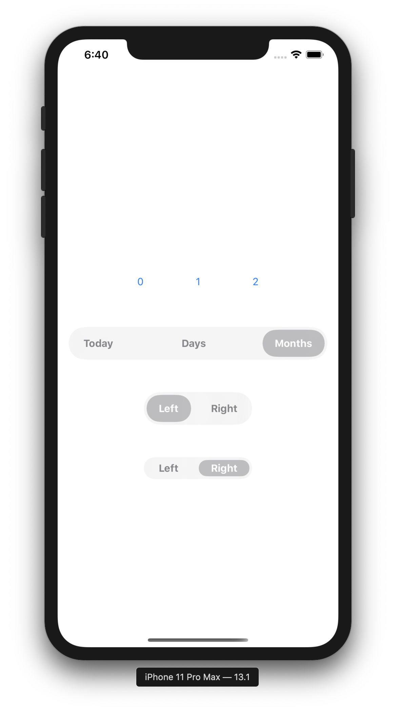
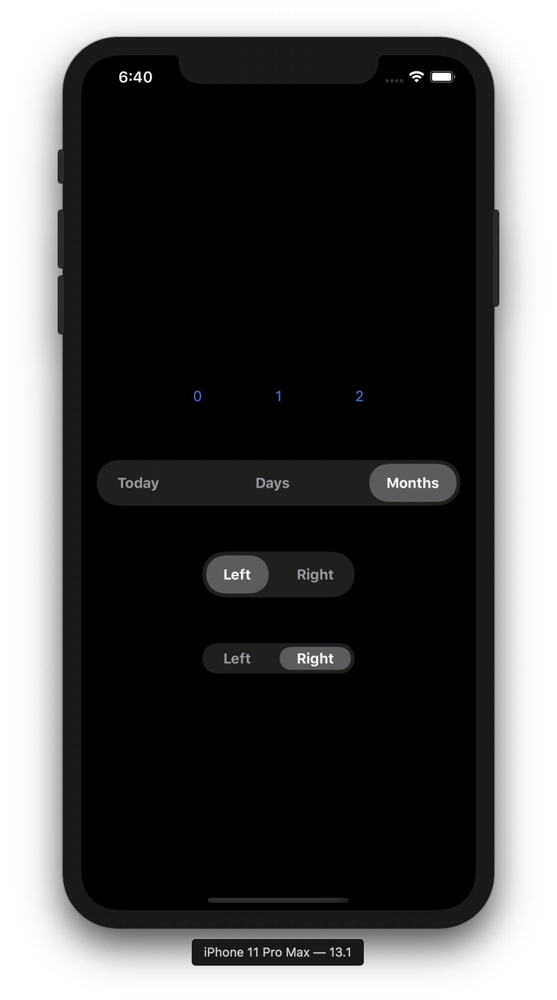

# FloatingSegmentedControl
Provide segment control like iOS13 photo app

    
    
    

## This library makes this repository easy to use 👀
[FloatingSwitch]https://github.com/usagimaru/FloatingSwitch

1             |  2
:-------------------------:|:-------------------------:
  |  

# Installation 🚀

## Carthage
`github "catelina777/FloatingSegmentedControl"`

# Usage
1. Install a custom view on Interface Builder.
2. ***Important:*** Assign the custom view class as `FloatingSegmentedControl` like [this](Images/custom_view.png).
3. Set an appropriate layouts. In the default implementation of FloatingSegment, the width follows the intrinsic size.
4. Set segments with `setSegments (with:)` method.
5. Set `target` and `action` with addTarget method. Then you can catch control events when users switch segments.

See `ViewController.swift` for usage.
